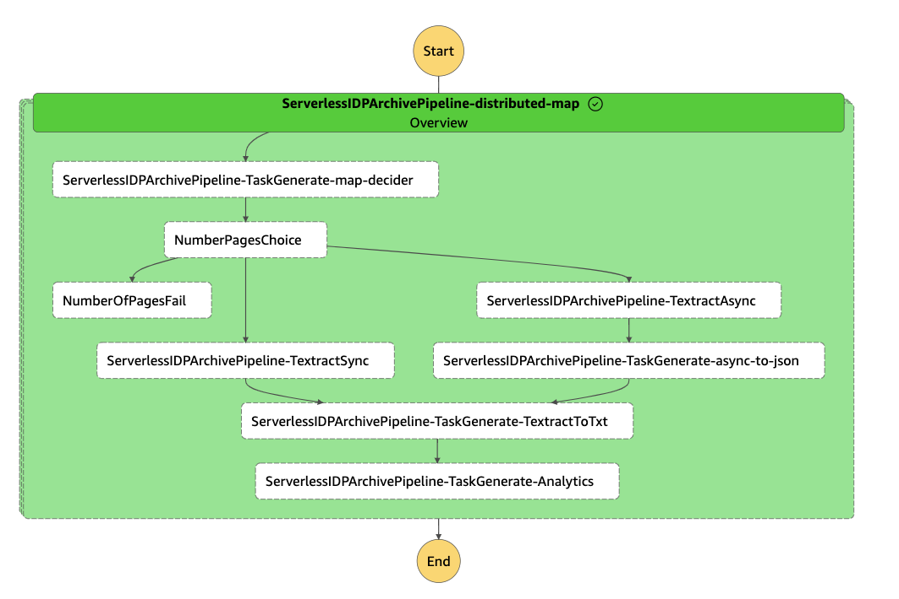
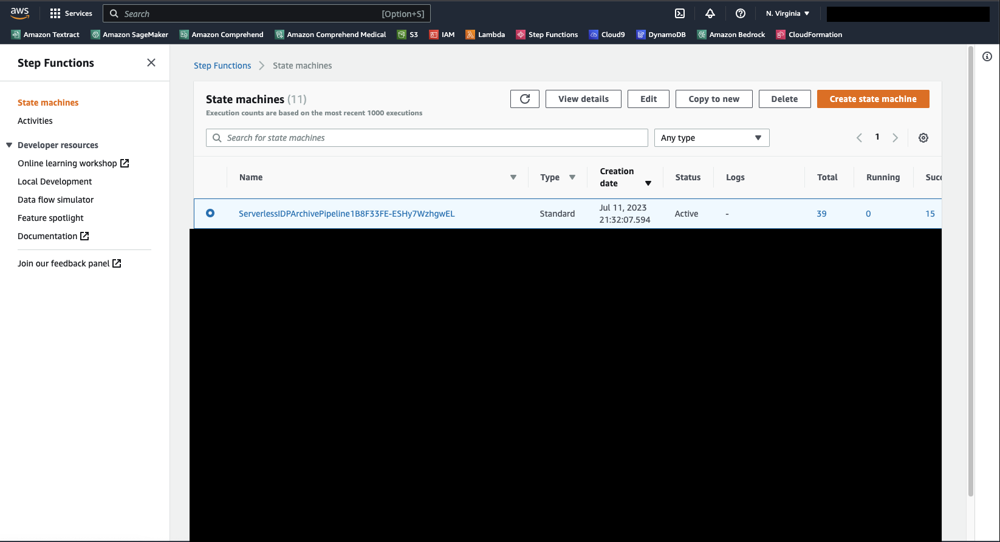
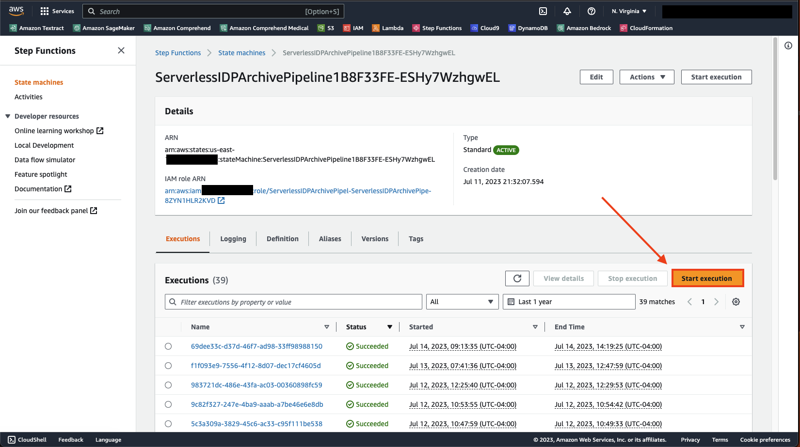
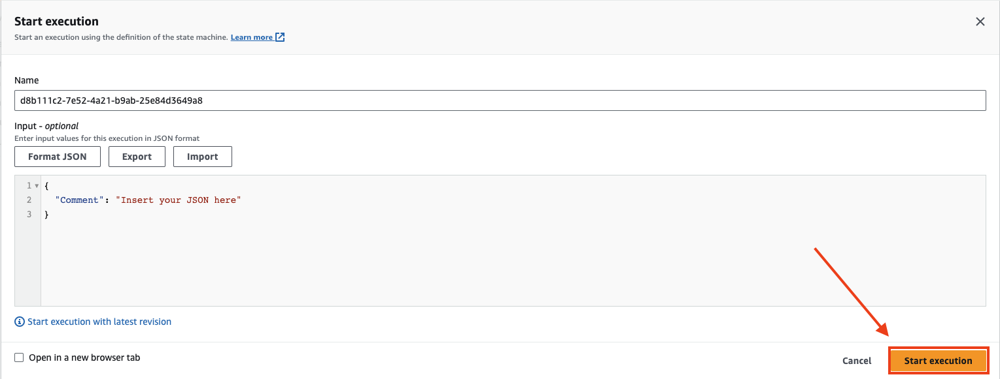

# IDP Archival Pipeline

## Name
IDP Archival Pipeline

## Description
This solution leverages AWS Step Functions and Lambda functions to orchestrate this process.  We are leveraging Step Functions Distributed Map to iterate over all the files in your S3 bucket and initiate processing.  The first lambda will determine how many pages your documents has.  This enables the pipeline to automatically select the right API to leverage sync for single page documents and async for multi-page documents.  Next it calls the proper API, if it calls Textract async API there is an additional step to join all the JSONs that Textract will produce for all of your pages into 1 JSON to make it easier for your down stream applications to work with the information.  

## Architecture Diagram


## Prerequisites For CDK Construct Solution
This codebase uses the  AWS Cloud Development Kit (AWS CDK). Also it requires Docker.

You can deploy this from a AWS Cloud9 instance, which has the AWS CDK and docker already set up.
The Source Bucket and Source Prefix are required.  
## Installation
```bash
pip install -r requirements.txt
cdk bootstrap
cdk deploy ServerlessIDPArchivePipeline -no-previous-parameters --parameters SourceBucket=test-bucket --parameters SourcePrefix=test-prefix
```
cdk deploy ServerlessIDPArchivePipeline -no-previous-parameters --parameters SourceBucket=test-bench --parameters SourcePrefix=curated_300

## Execution
After the deployment is done navigate to your console and open the Step Functions page you should see a ServerlessIDPArchivePipeline select that link.  


Then Select Start Execution


Then in the modal select Start Execution again 
